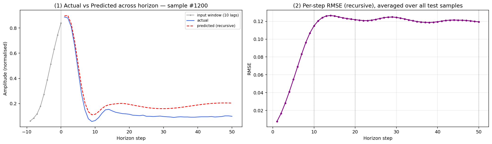

# ECG Forecasting with NG-RC / NVAR (MIT-BIH)

## What was done

- **Preprocessing** — load the `MLII` lead for 21 patients, take 100,000 samples each, split into
  **train (40k) / validation (10k) / test (50k)**, MinMax-normalise (scaler fit on train only), and
  build sliding windows of **10 lags → next step**. This is an *intra-patient* temporal split.
- **1-step forecasting (NG-RC / NVAR)** - Hyperparameters (`alpha`, `degree`)
  are chosen automatically with **Optuna** on the validation split.
- **Recursive multi-step forecasting** — feed each 1-step prediction back in as the newest lag and
  roll forward to horizons **10 / 20 / 50**. 

All results below are for **patient 103** (the notebook's demo patient).

## How to run

```bash
uv pip install -r requirements.txt          # deps
```

Then open `Dudukcu2023_Preprocessing_Only (1).ipynb` in VS Code / Jupyter, select the `.venv` kernel,
and **Run All**. (The MIT-BIH data folder must sit next to the notebook — it already does.)

## Results (patient 103)

**1-step forecasting**

| Metric | NG-RC / NVAR | Naive baseline |
|---|---|---|
| RMSE | **0.0054** | 0.0278 |
| MAE  | 0.0040 | — |

→ about **5× better** than the "repeat the last value" baseline.

**Recursive multi-step forecasting**

| Horizon | RMSE | MAE | R² | Time (s) |
|--------:|-----:|----:|---:|---------:|
| 10 | 0.0716 | 0.0301 | 0.619 | 0.10 |
| 20 | 0.1012 | 0.0499 | 0.239 | 0.21 |
| 50 | 0.1137 | 0.0589 | 0.039 | 0.52 |

**Takeaway:** 1-step prediction is excellent. Accuracy drops as the horizon grows — by 50 steps the
error saturates and R² is near zero, since the recursive model smooths away the sharp ECG peaks.

## Graph



*Left:* actual vs predicted across the horizon for one sample.
*Right:* per-step RMSE averaged over all test samples (how error grows with horizon).
